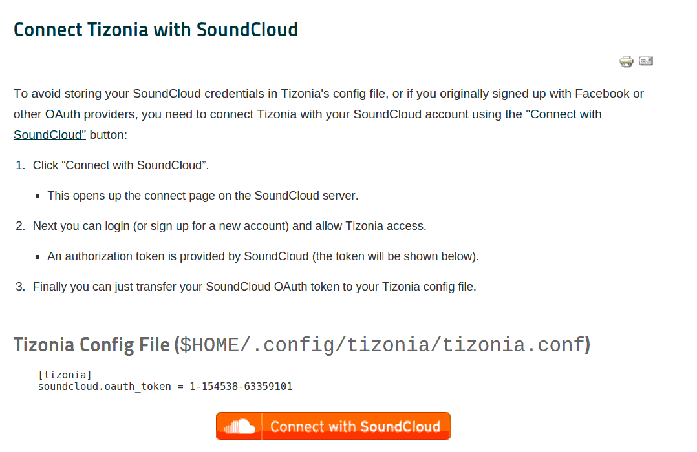

SoundCloud
==========

To stream from SoundCloud Tizonia needs to be authorized to access your
SoundCloud account. For that you need to obtain your `OAuth
<http://oauth.net/>`_ token provided by SoundCloud and put it into your
``tizonia.conf`` file. For more details please read about the `Connect with
SoundCloud <https://blog.soundcloud.com/2010/01/25/connect/>`_ feature.

Please go to `Aratelia's Website
<http://www.aratelia.com/index.php/open-source/77-main/88-connect-with-soundcloud#>`_  [#f1]_
to retrieve your SoundCloud OAuth token.

CONFIGURATION
-------------

The Tizonia configuration file contains a block under the ``[tizonia]`` section
like the one pictured below (see also :ref:`tizonia-config-label`).

.. warning:: When credentials are stored in your local
             ``tizonia.conf``, please ensure that this file has the correct
             file system permissions to prevent other users from accessing your
             credentials.

             E.g.: ``$ chmod og-rwx $HOME/.config/tizonia/tizonia.conf``

.. code-block:: bash

   # SoundCloud configuration
   # -------------------------------------------------------------------------
   # To avoid passing this information on the command line, uncomment and
   # configure your SoundCloud OAuth token here.
   #
   # To obtain your OAuth token, Tizonia needs to be granted access to your
   # SoundCloud account. Visit https://tizonia.org/docs/soundcloud/ for the
   # details.
   #
   # soundcloud.oauth_token = X-XXXXXX-XXXXXXXX-XXXXXXXXXXXXXX
   # soundcloud.buffer_seconds = size of the audio buffer (in seconds) to use
   #                             while downloading streams. Default: 600.
   #                             Increase in case of cuts.

``soundcloud.buffer_seconds``
  This is the minimum size of the audio buffer (in seconds) that Tizonia will
  use while downloading the audio streams. It may be increased in case of
  cuts, but usually not required. Default: 600.

OPTIONS
-------

``--soundcloud-oauth-token arg``
    SoundCloud user OAuth token (not required if provided via config file).

``--soundcloud-user-stream``
    Play the tracks currently listed in the user's stream.

``--soundcloud-user-likes``
    Play the tracks liked by the user.

``--soundcloud-user-playlist arg``
    Play a playlist from the user's collection.

``--soundcloud-creator arg``
    Search and play the top 50 tracks from a creator.

``--soundcloud-tracks arg``
    Search and play tracks by title (50 first matches only).

``--soundcloud-playlists arg``
    Search and play playlists by title.

``--soundcloud-genres arg``
    Search and play genres top tracks (arg is a command-separated list).

``--soundcloud-tags arg``
    Search and play tags top tracks (arg is a command-separated list).

EXAMPLES
--------

.. code-block:: bash

   $ tizonia --soundcloud-tracks 'all right now'

   $ tizonia --soundcloud-creator "twit"

   $ tizonia --soundcloud-genres "piano"

.. rubric:: Footnotes

.. [#f1] Aratelia is Juan A. Rubio's consultancy and Tizonia's sponsor.
