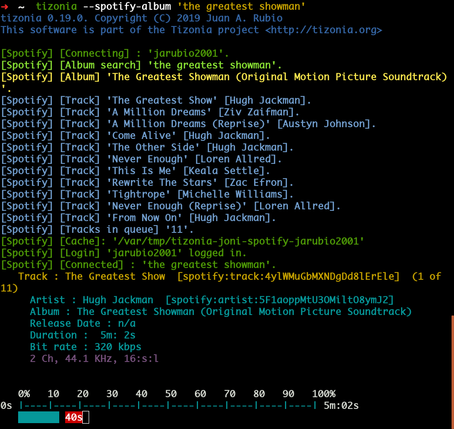
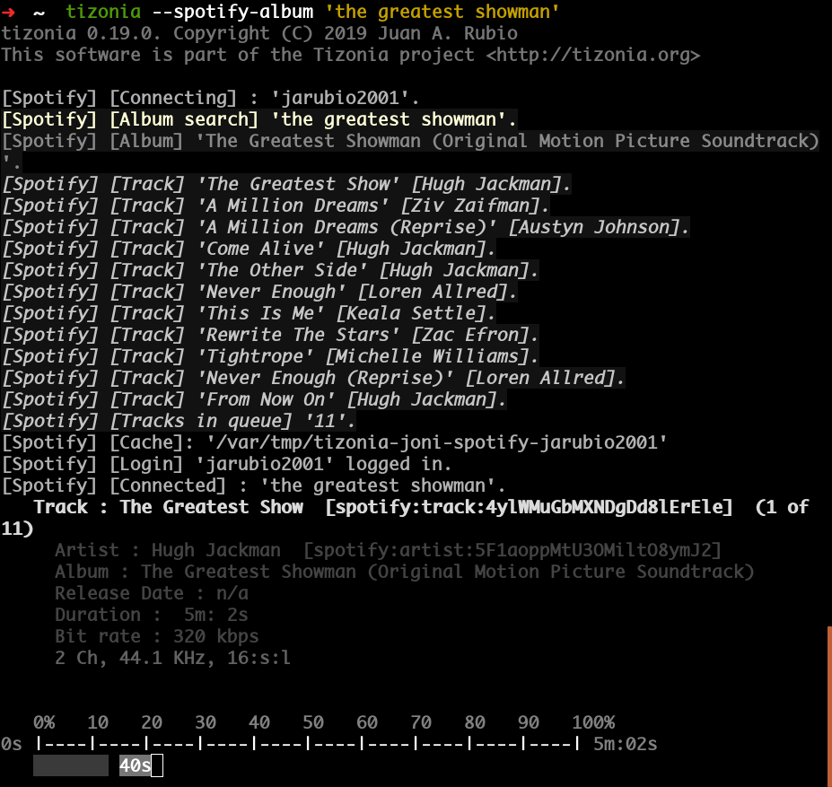
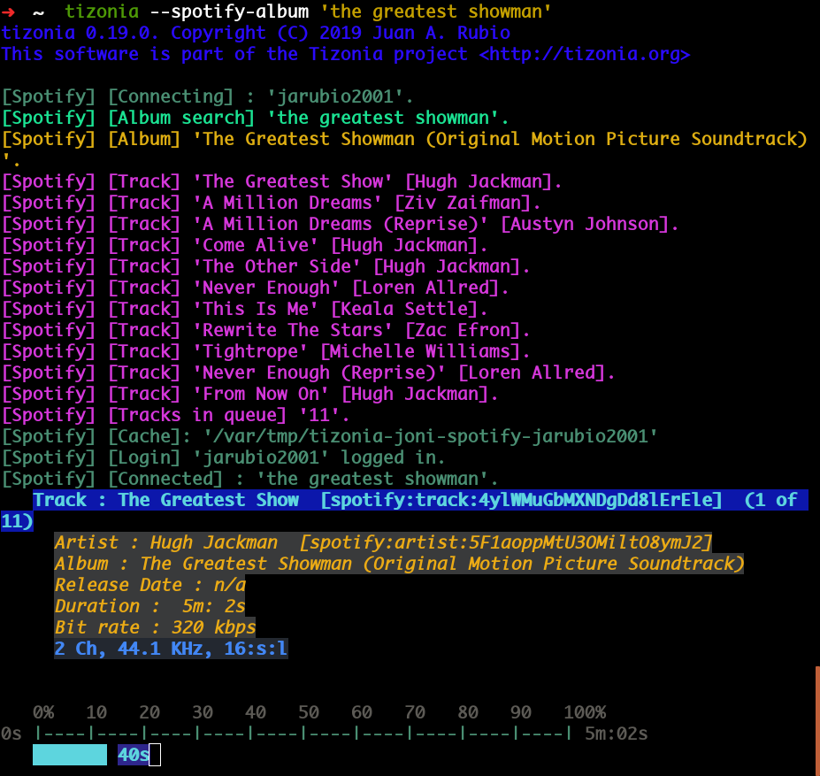
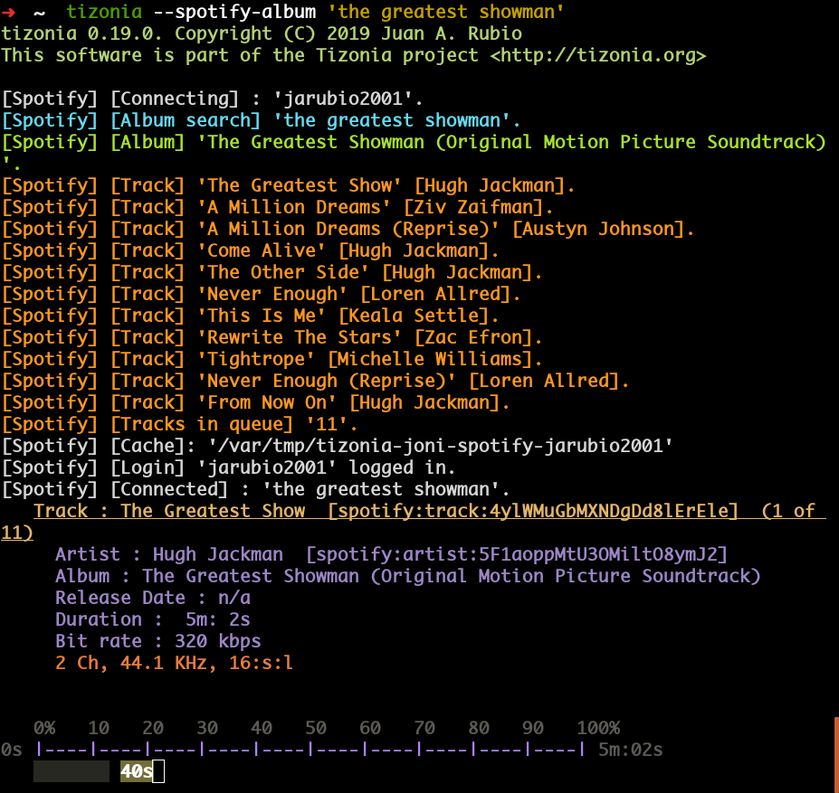

Color Themes
============

Tizonia supports color-themes. To customize the colors of Tizonia's output on
the terminal, simply select one of the four color themes shipped within
``tizonia.conf`` (available from 0.20.0+). The color themes are:

* tizonia (the default theme),
* black,
* blink,
* and monokai

Use these color themes as examples/templates. Adding new color themes should be
relatively straightforward with a bit of experimentation.

To activate a particular color theme within ``tizonia.conf``, simply select it
using the ``active-theme`` element in ``tizonia.conf`` (please check that your
terminal supports the corresponding color bit-depth).

.. code-block:: ini
   :linenos:

   [color-themes]
   # Tizonia uses around 16 different colors while displaying information on the
   # terminal. These colors are referred to in this configuration file as:
   # C01, C02, ..., C15, C16.
   #
   # There are three options for specifying the color codes (depending on the
   # number of colors supported by the terminal; most terminals should support all
   # three options).
   #
   # OPTION 1: 3/4-bit color codes
   #     https://en.wikipedia.org/wiki/ANSI_escape_code#3/4_bit
   #           Normal FG colors: 30-37 - Bright FG colors: 90-97
   #           Normal BG colors: 40-47 - Bright BG colors: 100-107
   #
   # OPTION 2: 8-bit color codes:
   #     https://en.wikipedia.org/wiki/ANSI_escape_code#8-bit
   #           38,5,⟨n⟩ -> Foreground color
   #           48,5,⟨n⟩ -> Background color
   #
   # OPTION 3: 24-bit color codes:
   #     https://en.wikipedia.org/wiki/ANSI_escape_code#24-bit
   #           38,2,⟨r⟩,⟨g⟩,⟨b⟩ -> RGB foreground color
   #           48,2,⟨r⟩,⟨g⟩,⟨b⟩ -> RGB background color
   #
   # In addition to the foreground and background color codes, the font display
   # attributes or 'decorations' may also be specified.
   #
   # Display attributes (a.k.a. decorations):
   #     https://en.wikipedia.org/wiki/ANSI_escape_code#SGR_parameters
   #           1 -> Bold, 2 -> Faint, 3 -> Italic, 4 -> Underline, 5 -> Slow blink,
   #           etc...
   #
   # Then, to specify a C01-C16 color for Tizonia, choose one of the bit depth
   # options above and compose your Cxy code like this:
   #
   # Cxy = <fg>,<bg>,<attr>
   #
   # Note that there is no need to provide all three of <fg>, <bg> and <attr>, but
   # at least one of them should be given for the Cxy color to be of any use.
   #
   # You can use multiple bit-depth definitions in a color theme (e.g. C01-C08
   # defined using 3/4 bit codes, and C09-C16 using 24-bit), but you should stick
   # with one bit-depth for <fg>,<bg> within the same Cxy definition.
   #
   #
   #
   # There are four color themes available in this config file:
   #
   #  tizonia (the default theme), black, blink, and monokai
   #
   # To activate a color theme, add its name and uncomment the following line.
   #
   active-theme = tizonia

Color-theme: tizonia
--------------------

.. code-block:: ini

   # 'tizonia' color theme (default 3/4-bit theme).
   # =============================================
   # NOTE: C01-C07 -> Misc. colors.
   # NOTE: C08-C12 -> These usually are bright FG colors, for some important messages.
   # NOTE: C13-C16 -> The colors used in the progress bar display.
   # IMPORTANT: Only commas are allowed between digits in the color definition, no SPACES!.
   # ---------------------------------------------
   tizonia.C01 = 31        # Red     FG, no BG or Decoration - Hint: error messages.
   tizonia.C02 = 32        # Green   FG, no BG or Decoration - Hint: higher importance info messages.
   tizonia.C03 = 33        # Yellow  FG, no BG or Decoration - Hint: song/stream title.
   tizonia.C04 = 34        # Blue    FG, no BG or Decoration - Hint: normal importance info messages.
   tizonia.C05 = 35        # Magenta FG, no BG or Decoration - Hint: other info messages (e.g. '2 Ch, 44.1 KHz, 16:s:b').
   tizonia.C06 = 36        # Cyan    FG, no BG or Decoration - Hint: various song/stream infos (e.g. album, duration, etc).
   tizonia.C07 = 37        # White   FG, no BG or Decoration - Hint: seldom used. For future use.

   tizonia.C08 = 91        # Bright Red     FG, no BG or Decoration - Hint: additional error messages.
   tizonia.C09 = 92        # Bright Green   FG, no BG or Decoration - Hint: additional higher importance info messages.
   tizonia.C10 = 93        # Bright Yellow  FG, no BG or Decoration - Hint: useful data, highlighted messages.
   tizonia.C11 = 94        # Bright Blue    FG, no BG or Decoration - Hint: tracks the in playlist.
   tizonia.C12 = 95        # Bright Magenta FG, no BG or Decoration - Hint: other useful data messages.

   tizonia.C13 = 36        # Cyan FG  - Hint: the percentage bar.
   tizonia.C14 = 37        # White FG - Hint: the digits in the percentage bar.
   tizonia.C15 = 41        # Red BG   - Hint: the song's elapsed time.
   tizonia.C16 = 46        # Cyan BG  - Hint: the moving progress bar itself (IMPORTANT: This must a BG code, no FG or attr.).

Color-theme: black
------------------

.. code-block:: ini

   # 'Black' color theme (8-bit).
   # ===========================
   # NOTE: C01-C07 -> Misc. colors.
   # NOTE: C08-C12 -> These usually are bright FG colors, for some important messages.
   # NOTE: C13-C16 -> The colors used in the progress bar display.
   # IMPORTANT: Only commas are allowed between digits in the color definition, no SPACES!.
   # ---------------------------
   black.C01 = 38,5,9               # Hint: error messages.
   black.C02 = 38,5,249             # Hint: higher importance info messages.
   black.C03 = 38,5,253,1           # Hint: song/stream title.
   black.C04 = 38,5,243             # Hint: normal importance info messages.
   black.C05 = 38,5,241             # Hint: other info messages (e.g. '2 Ch, 44.1 KHz, 16:s:b').
   black.C06 = 38,5,238             # Hint: various song/stream infos (e.g. album, duration, etc).
   black.C07 = 38,5,255             # Hint: seldom used. For future use.

   black.C08 = 38,5,9               # Hint: additional error messages.
   black.C09 = 38,5,230,48,5,233    # Hint: additional higher importance info messages.
   black.C10 = 38,5,245,48,5,233    # Hint: useful data, highlighted messages.
   black.C11 = 38,5,251,48,5,233,3  # Hint: tracks the in playlist.
   black.C12 = 38,5,245,48,5,233    # Hint: other useful data messages.

   black.C13 = 38,5,231             # Hint: the percentage bar.
   black.C14 = 38,5,244             # Hint: the digits in the percentage bar.
   black.C15 = 48,5,243             # Hint: the song's elapsed time (a BG code).
   black.C16 = 48,5,237             # Hint: the moving progress bar itself (a BG code).

Color-theme: blink
------------------

.. code-block:: ini

   # 'Blink' color theme (24-bit).
   # =============================
   # NOTE: C01-C07 -> Misc. colors.
   # NOTE: C08-C12 -> These usually are bright FG colors, for some important messages.
   # NOTE: C13-C16 -> The colors used in the progress bar display.
   # IMPORTANT: Only commas are allowed between digits in the color definition, no SPACES!.
   # -----------------------------
   blink.C01 = 38,2,255,255,255,48,2,235,21,25    # Hint: error messages  (default theme: red)
   blink.C02 = 38,2,74,143,115                    # Hint: higher importance info messages  (default theme: green)
   blink.C03 = 38,2,93,213,222,48,2,12,23,171,1   # Hint: song/stream title  (default theme: yellow)
   blink.C04 = 38,2,42,10,252                     # Hint: normal importance info messages  (default theme: blue)
   blink.C05 = 38,2,66,135,245,48,2,35,40,48,1    # Hint: other info messages (e.g. '2 Ch, 44.1 KHz, 16:s:b')  (default theme: magenta)
   blink.C06 = 38,2,235,171,21,48,2,57,58,59,3    # Hint: various song/stream infos (e.g. album, duration, etc)  (default theme: cyan)
   blink.C07 = 38,2,255,255,255                   # Hint: seldom used. For future use (default theme: white)

   blink.C08 = 38,2,255,255,255,48,2,235,21,25    # Hint: additional error messages.
   blink.C09 = 38,2,27,227,147                    # Hint: additional higher importance info messages.
   blink.C10 = 38,2,222,174,18                    # Hint: useful data, highlighted messages.
   blink.C11 = 38,2,214,55,219                    # Hint: tracks the in playlist.
   blink.C12 = 38,2,255,255,255                   # Hint: other useful data messages.

   blink.C13 = 38,2,74,143,115,5                  # Hint: the percentage bar.
   blink.C14 = 38,2,92,90,85                      # Hint: the digits in the percentage bar. (NOTE: decoration: 5 -> blink)
   blink.C15 = 38,2,93,213,222,48,2,46,38,140,1   # Hint: the song's elapsed time.
   blink.C16 = 48,2,93,213,222                    # Hint: the moving progress bar itself (IMPORTANT: This must a BG code, no FG or attr.).

Color-theme: monokai
--------------------

.. code-block:: ini

   # 'Monokai' color theme (24-bit).
   # ==============================
   # NOTE: C01-C07 -> Misc. colors.
   # NOTE: C08-C12 -> These usually are bright FG colors, for some important messages.
   # NOTE: C13-C16 -> The colors used in the progress bar display.
   # IMPORTANT: Only commas are allowed between digits in the color definition, no spaces PLEASE!.
   # ------------------------------
   monokai.C01 = 38,2,121,121,121         # Hint: error messages  (default theme: red)
   monokai.C02 = 38,2,214,214,214         # Hint: higher importance info messages  (default theme: green)
   monokai.C03 = 38,2,229,181,103,4       # Hint: song/stream title  (default theme: yellow)
   monokai.C04 = 38,2,180,210,115         # Hint: normal importance info messages  (default theme: blue)
   monokai.C05 = 38,2,232,125,62          # Hint: other info messages (e.g. '2 Ch, 44.1 KHz, 16:s:b')  (default theme: magenta)
   monokai.C06 = 38,2,158,134,200         # Hint: various song/stream infos (e.g. album, duration, etc)  (default theme: cyan)
   monokai.C07 = 38,2,255,255,255         # Hint: seldom used. For future use (default theme: white)

   monokai.C08 = 38,2,249,38,114          # Hint: additional error messages.
   monokai.C09 = 38,2,102,217,239         # Hint: additional higher importance info messages.
   monokai.C10 = 38,2,166,226,46          # Hint: useful data, highlighted messages.
   monokai.C11 = 38,2,253,151,31          # Hint: tracks the in playlist.
   monokai.C12 = 38,2,255,255,255         # Hint: other useful data messages.

   monokai.C13 = 38,2,174,129,255         # Hint: the percentage bar.
   monokai.C14 = 38,2,92,90,85            # Hint: the digits in the percentage bar. (NOTE: decoration: 5 -> blink)
   monokai.C15 = 48,2,115,109,56,1        # Hint: the song's elapsed time.
   monokai.C16 = 48,2,39,40,34            # Hint: the moving progress bar itself (IMPORTANT: This must a BG code, no FG or attr.).
